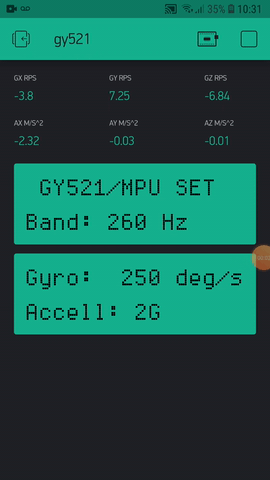

# blynk-mpu6050

Render values gyroscope and accelerometer GY521/MPU6050 in smartphone with app Blynk to WIFI network.

## Circuit


## App Blynk Android

Necessary download and create credentials in smartphone with app Blynk, then create project with eight component like the image down after setting pin virtual (see code Arduino or [video](https://youtu.be/jKLlIxi5go0) in Youtube for more details).



## How use

Set value credentials with value received for email the Blynk app, and setting wifi your login and password.

```
// credential blynk send value for email when created project in mobile app
char auth[] = "";

/* config wifi */
char ssid[] = "";
char pass[] = "";

```

## Reference

[Adafruit_MPU6050.h Functions](https://adafruit.github.io/Adafruit_MPU6050/html/class_adafruit___m_p_u6050.html) Access in 31/05/2020

[Adafruit_MPU6050.h library](https://github.com/adafruit/Adafruit_MPU6050) Access in 31/05/2020

[Adafruit_BusIO_Register.h> library](https://github.com/adafruit/Adafruit_BusIO) Access in 31/05/2020

[Adafruit_Sensor.h library](https://github.com/adafruit/Adafruit_Sensor) Access in 31/05/2020

[Baby Blink Monitor Thing](https://www.sparkfun.com/news/2185) Access in 31/05/2020
